# AbraFlexi Závěrka DE

Webová aplikace pro přípravu podkladů k uzavření daňové evidence dle § 19 ZoÚ.

## Instalace

```bash
pip install -r requirements.txt
# nebo: pip install flask "python-abraflexi>=1.1.2" flask-babel
```

## Spuštění

```bash
python app.py
```

Aplikace poběží na: http://localhost:5050

## Funkce

- **Připojení k AbraFlexi** – zadejte URL, firmu, uživatele a heslo
  - (env proměnné: ABRAFLEXI_URL, ABRAFLEXI_COMPANY, ABRAFLEXI_LOGIN, ABRAFLEXI_PASSWORD)
- **Pohledávky & Závazky** – vydané a přijaté faktury s barevným zvýrazněním po splatnosti
- **Kniha majetku** – karty majetku, vstupní a zůstatkové ceny
- **Pokladní kniha** – pohyby v pokladně za vybraný rok
- **Bankovní výpisy** – pohyby na bankovních účtech
- **Adresář** – dodavatelé a odběratelé
- **Inventura skladu** – stav skladových karet
- **Export CSV** – každá evidence lze exportovat do CSV
- **Kontrolní seznam** – interaktivní 18-bodový checklist závěrkových prací
  (body 13 a 15 jsou napojeny na skutečné akce konce roku níže, zbytek jsou
  ruční kroky vyžadující úsudek – inventury, rezervy, časové rozlišení)

## Akce konce roku

Na rozdíl od výše uvedených čistě čtecích přehledů provádí tyto akce
skutečné zápisy do AbraFlexi a vyžadují uživatele s odpovídajícím
oprávněním k zápisu:

- **Inicializace účetního období** – převede konečné zůstatky do
  následujícího účetního období. Lze spouštět opakovaně. Volitelně provede
  přecenění neuhrazených dokladů v cizí měně (nejprve načtěte aktuální kurzy
  tlačítkem „Zkontrolovat měny pro přecenění“; měna s chybějícím/nulovým
  kurzem musí mít kurz zadaný ručně) a převod skladu. AbraFlexi zpracovává
  inicializaci na pozadí (HTTP 202 Accepted) – aplikace průběžně kontroluje
  dokončení, u větších dat to může chvíli trvat.
- **Uzamknutí účetního období** – uzamkne období pro jeden nebo více modulů
  dokladů (vydané/přijaté faktury, banka, pokladna, majetek atd.), takže
  doklady již nelze upravovat. Je nutné vybrat alespoň jeden modul.

Inicializace účetního období má také nepovinnou sekci „Účty podvojného
účetnictví“ (účet otevření/uzavření/převodu výsledku hospodaření/výsledku
ve schvalovacím řízení). U firem typu daňová evidence ji ponechte prázdnou;
vyplňte ji pouze při připojení k firmě s podvojným účetnictvím, kde ji
AbraFlexi pro tuto operaci vyžaduje.

## Snímky obrazovky

Kompletní průchod aplikací proti reálné testovací firmě v AbraFlexi
(`testa_invest_s_r_o_`), včetně skutečného spuštění obou akcí konce roku.

### 1. Vyplněný přihlašovací panel
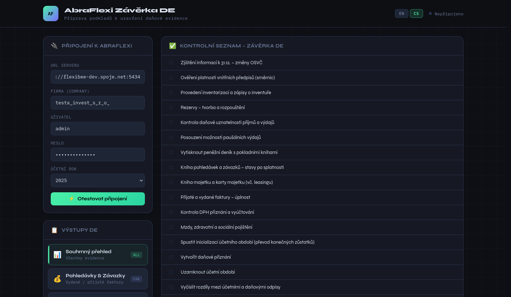
Levý panel „Připojení k AbraFlexi“ s vyplněnou URL serveru
(`flexibee-dev.spoje.net:5434`), identifikátorem firmy
(`testa_invest_s_r_o_`), uživatelským jménem a heslem. Připojení ještě
nebylo otestováno – stav vpravo nahoře stále ukazuje „Nepřipojeno“.

### 2. Úspěšné připojení
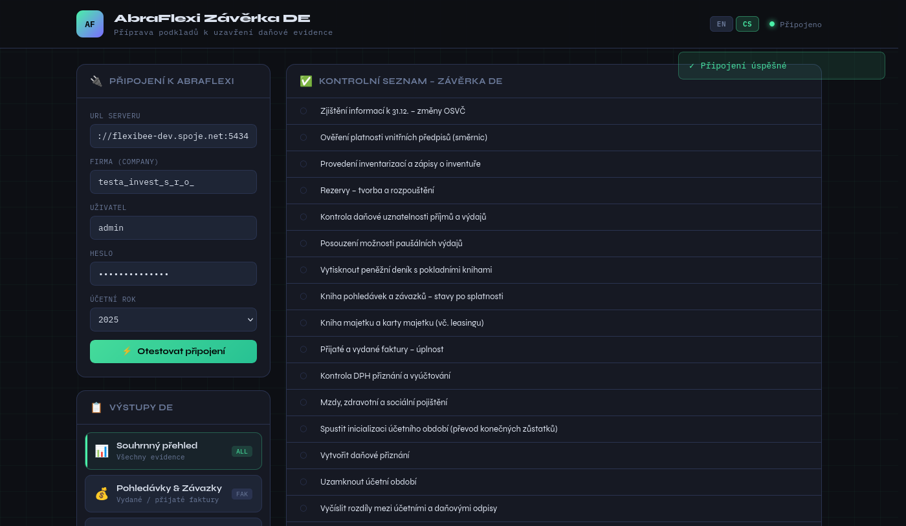
Po kliknutí na „Otestovat připojení“ aplikace provedla skutečný
autentizovaný požadavek na server AbraFlexi. Stavová tečka zezelená a
ukazuje „Připojeno“, úspěšná hláška potvrzuje platnost přihlašovacích
údajů a URL.

### 3. Přehled s reálnými daty
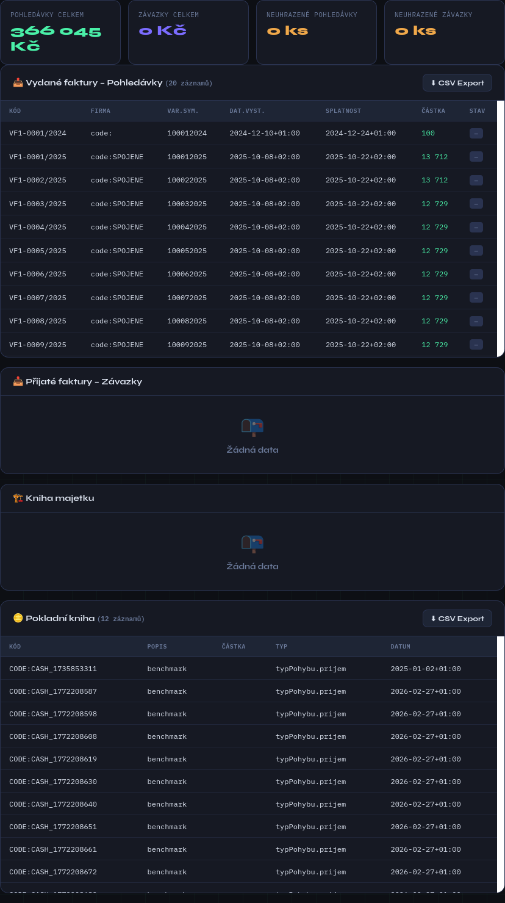
Modul „Souhrnný přehled“ po kliknutí na „Načíst data z AbraFlexi“: reálné
součty (pohledávky, závazky) a tabulky Vydaných faktur a Pokladní knihy
naplněné skutečnými záznamy načtenými přímo z testovací firmy. Evidence bez
dat pro tuto firmu (Přijaté faktury, Kniha majetku) korektně zobrazují
prázdný stav místo chyby.

### 4. Kontrolní seznam (výchozí stav)
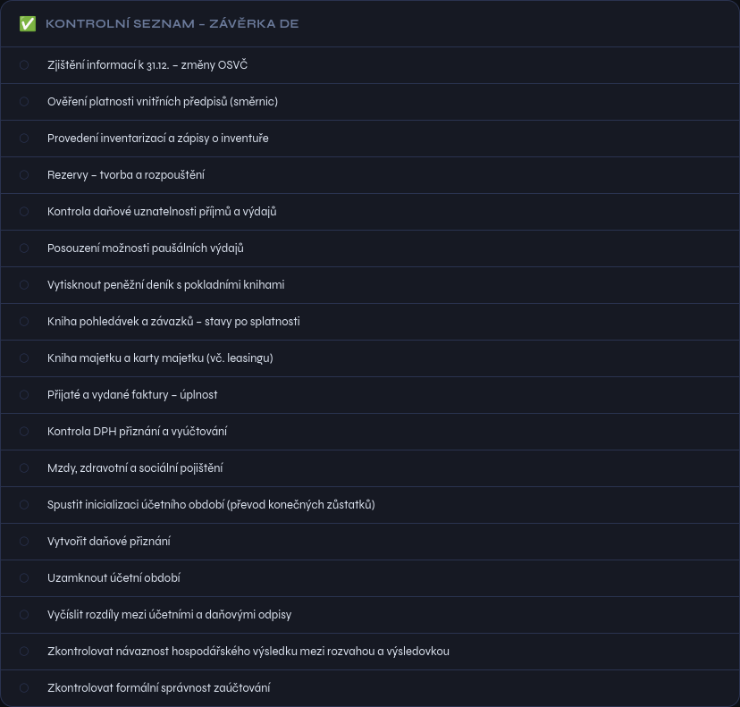
Celý 18bodový kontrolní seznam před spuštěním jakékoli akce. Body 1–12 a
14, 16–18 jsou ruční kroky vyžadující úsudek (inventury, rezervy, příprava
daňového přiznání atd.), zaškrtávané ručně; body 13 („Spustit inicializaci
účetního období“) a 15 („Uzamknout účetní období“) jsou napojeny na dvě
skutečné akce níže a při úspěchu se zaškrtnou automaticky.

### 5. Formulář inicializace období
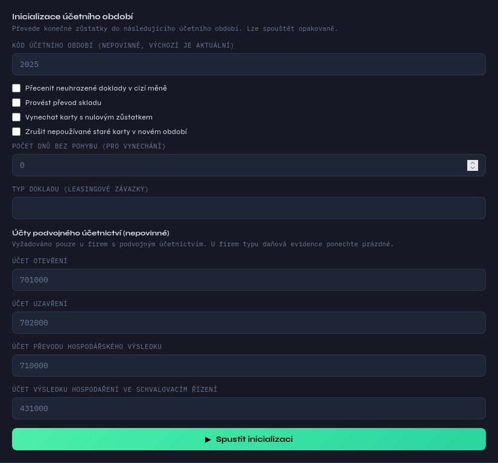
Formulář inicializace účetního období: kód účetního období, volby
přecenění/převodu skladu/rušení starých karet, a – protože tato konkrétní
testovací firma vede podvojné účetnictví, nikoli daňovou evidenci –
nepovinné kódy účtu otevření/uzavření/převodu výsledku/výsledku ve
schvalovacím řízení, vyplněné reálnými kódy zjištěnými z účtového rozvrhu
firmy.

### 6. Kontrola přecenění měn
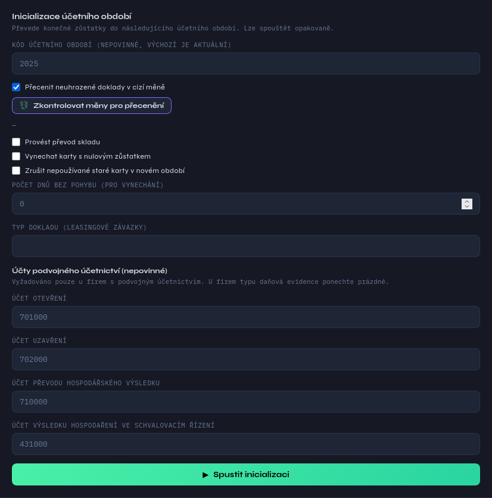
Výsledek kliknutí na „Zkontrolovat měny pro přecenění“ se zapnutou volbou
přecenění – u této firmy nečeká na přecenění žádný doklad v cizí měně,
seznam je tedy prázdný. Pokud se najdou měny s chybějícím/nulovým kurzem,
zobrazí se zde s editovatelnými poli kurzu ještě před spuštěním
inicializace.

### 7. Inicializace období probíhá
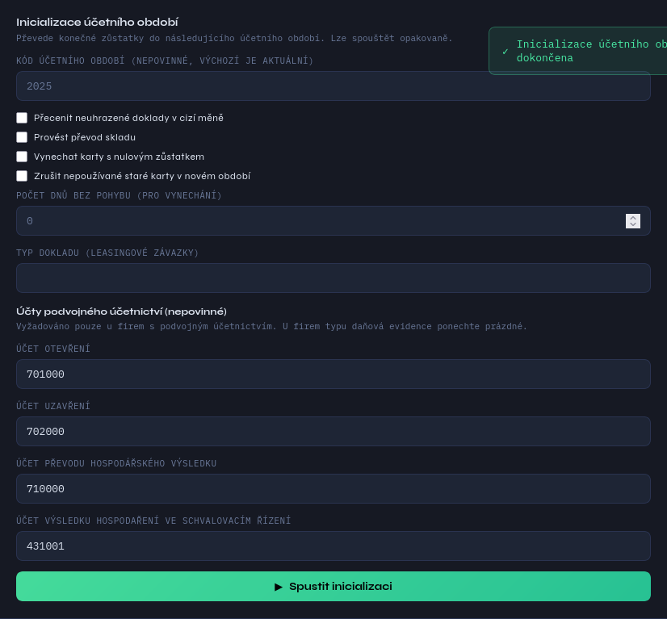
Ihned po kliknutí na „Spustit inicializaci“. AbraFlexi požadavek přijme
(HTTP 202) a zpracovává jej jako úlohu na pozadí na straně serveru;
aplikace zobrazí odznak čekání a začne kontrolovat dokončení.

### 8. Inicializace období dokončena
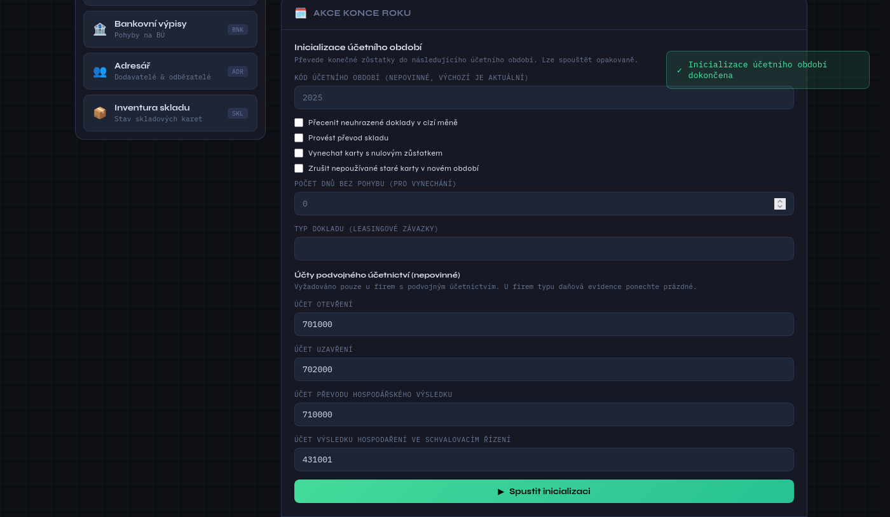
Jakmile kontrola na straně aplikace zjistí, že úloha na serveru AbraFlexi
skončila (sledováním posunu časového razítka `lastUpdate` účetního
období), zobrazí se úspěšná hláška a odznak čekání zmizí.

### 8b. Kontrolní seznam po inicializaci

Kontrolní seznam automaticky odráží skutečný výsledek: „Spustit inicializaci
účetního období“ je nyní zaškrtnuto na základě reálné odpovědi AbraFlexi,
nikoli ručního kliknutí.

### 9. Formulář uzamknutí období
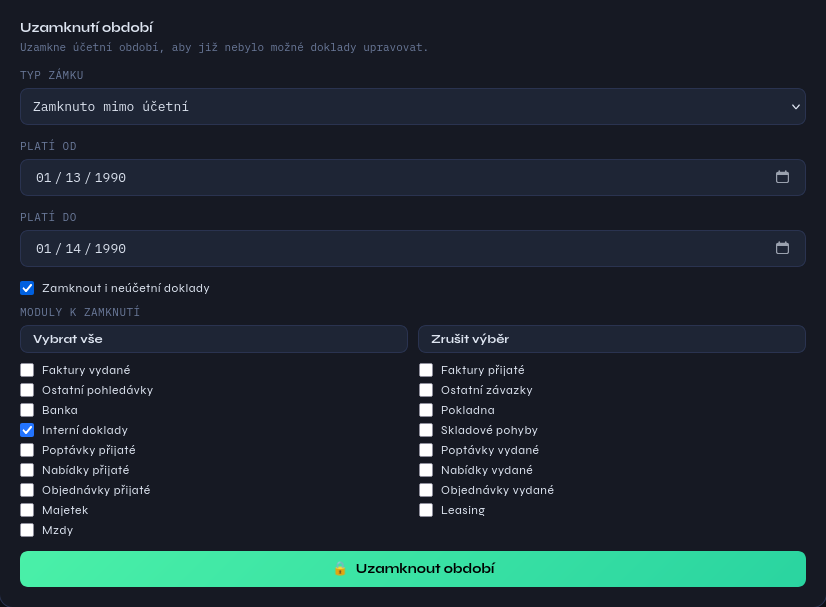
Formulář uzamknutí období, pro tuto ukázku se skutečným zápisem záměrně
omezený na minimum: stav „Zamknuto mimo účetní“, jednodenní historický
rozsah dat a vybraný pouze modul „Interní doklady“ – minimalizuje dopad na
sdílenou testovací firmu a zároveň otestuje skutečnou cestu zápisu.

### 10. Uzamknutí období úspěšné
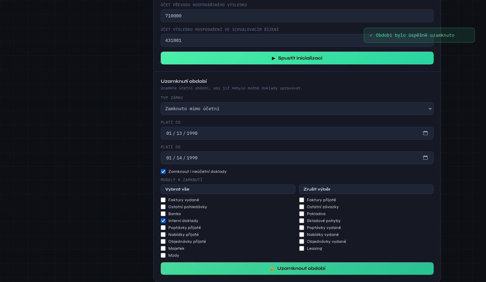
Výsledek kliknutí na „Uzamknout období“ – AbraFlexi požadavek přijalo a
vytvořilo záznam zámku, což potvrzuje úspěšná hláška.

### 10b. Kontrolní seznam po uzamknutí
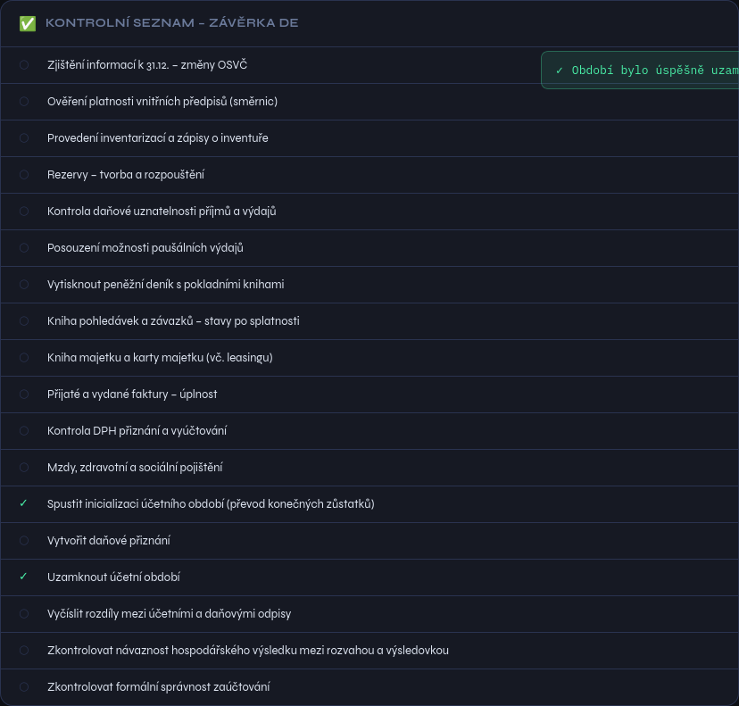
Konečný stav: obě automatizované položky checklistu (13 a 15) jsou
zaškrtnuté, což odráží skutečnost, že inicializace i uzamknutí účetního
období proběhly v AbraFlexi opravdu úspěšně.

## Požadavky

- Python 3.8+
- flask
- flask-babel
- python-abraflexi >= 1.1.2
