# AbraFlexi Closing DE

Web application for preparing documents for closing tax records according to Section 19 of the Tax Code.

## Installation

### From Debian Package

The easiest way to install the application is via the Debian package:

```bash
sudo dpkg -i abraflexi-yearend_0.1.0_all.deb
sudo apt-get install -f
```

### From Source

```bash
pip install -r requirements.txt
# or: pip install flask "python-abraflexi>=1.1.2" flask-babel
```

## Launch

### Manual Launch

```bash
abraflexi-yearend
```

The application will run at: http://localhost:5050

## Web Server Configuration

To run the application in a production environment, it is recommended to use a web server like Apache or Nginx as a reverse proxy.

### Apache Configuration

1. Install required modules:
   ```bash
   sudo a2enmod proxy proxy_http
   ```

2. Create a new configuration file `/etc/apache2/sites-available/abraflexi-yearend.conf`:
   ```apache
   <VirtualHost *:80>
       ServerName abraflexi-yearend.example.com

       ProxyPreserveHost On
       ProxyPass / http://127.0.0.1:5050/
       ProxyPassReverse / http://127.0.0.1:5050/

       ErrorLog ${APACHE_LOG_DIR}/abraflexi-yearend-error.log
       CustomLog ${APACHE_LOG_DIR}/abraflexi-yearend-access.log combined
   </VirtualHost>
   ```

3. Enable the site and restart Apache:
   ```bash
   sudo a2ensite abraflexi-yearend.conf
   sudo systemctl restart apache2
   ```

### Nginx Configuration

1. Create a new configuration file `/etc/nginx/sites-available/abraflexi-yearend`:
   ```nginx
   server {
       listen 80;
       server_name abraflexi-yearend.example.com;

       location / {
           proxy_pass http://127.0.0.1:5050;
           proxy_set_header Host $host;
           proxy_set_header X-Real-IP $remote_addr;
           proxy_set_header X-Forwarded-For $proxy_add_x_forwarded_for;
           proxy_set_header X-Forwarded-Proto $scheme;
       }
   }
   ```

2. Enable the site and restart Nginx:
   ```bash
   sudo ln -s /etc/nginx/sites-available/abraflexi-yearend /etc/nginx/sites-enabled/
   sudo systemctl restart nginx
   ```

## Functions

- **Connection to AbraFlexi** – enter URL, company, user and password
- (env variables: ABRAFLEXI_URL, ABRAFLEXI_COMPANY, ABRAFLEXI_LOGIN, ABRAFLEXI_PASSWORD)
- **Receivables & Payables** – issued and received invoices with color highlighting after maturity
- **Asset Book** – asset cards, input and residual prices
- **Cash Book** – cash register movements for the selected year
- **Bank statements** – movements on bank accounts
- **Address Book** – suppliers and customers
- **Warehouse inventory** – stock card status
- **Export CSV** – each record can be exported to CSV
- **Checklist** – interactive 18-step year-end checklist (items 13 and 15 are
  wired to the real Year-End Actions below; the rest are manual/judgment
  steps such as inventory counts, provisions and accruals)

## Year-End Closing Actions

Unlike the read-only dashboards above, these perform real write operations
against AbraFlexi and require an AbraFlexi user with appropriate write
permissions:

- **Period Initialization** ("Inicializace následujícího účetního období") –
  carries forward closing balances into the next accounting period. Can be
  run repeatedly. Optionally revalues unpaid foreign-currency documents
  (fetch current rates first via "Check currencies for revaluation"; any
  currency with a missing/zero rate must have one entered manually) and
  carries forward the warehouse. AbraFlexi processes this asynchronously
  (HTTP 202 Accepted, background job) — the UI polls for completion and can
  take a while on large datasets.
- **Period Lock** ("Uzamknutí účetního období") – locks the accounting period
  for one or more document modules (issued/received invoices, bank, cash,
  assets, etc.) so documents can no longer be modified. At least one module
  must be selected.

Period Initialization also has an optional "Double-entry bookkeeping
accounts" section (opening/closing/profit-transfer/result-in-approval
account codes). Leave it blank for daňová evidence (tax-record) companies;
fill it in only if connecting to a double-entry bookkeeping company, which
AbraFlexi requires for this operation.

## Screenshots

A full walkthrough against a real AbraFlexi test company
(`testa_invest_s_r_o_`), captured end-to-end including the two real
Year-End Actions actually being executed.

### 1. Connection panel filled in
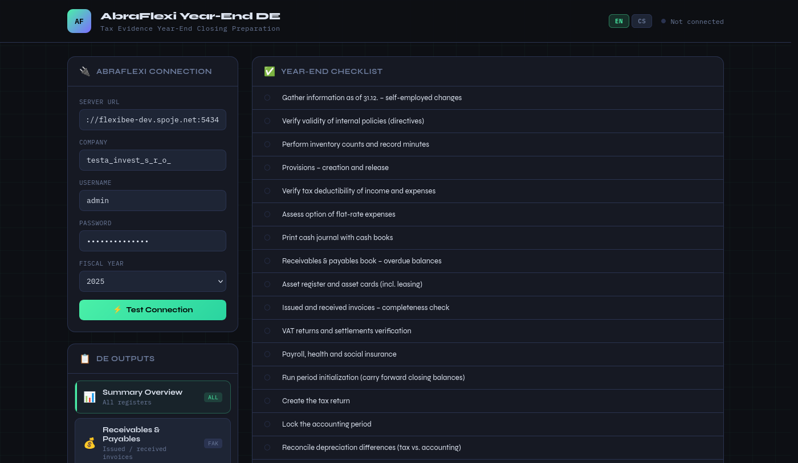
The left-hand "AbraFlexi Connection" panel with the server URL
(`flexibee-dev.spoje.net:5434`), company identifier
(`testa_invest_s_r_o_`), username and password entered. No connection has
been attempted yet — the status indicator in the top-right still reads
"Not connected".

### 2. Successful connection
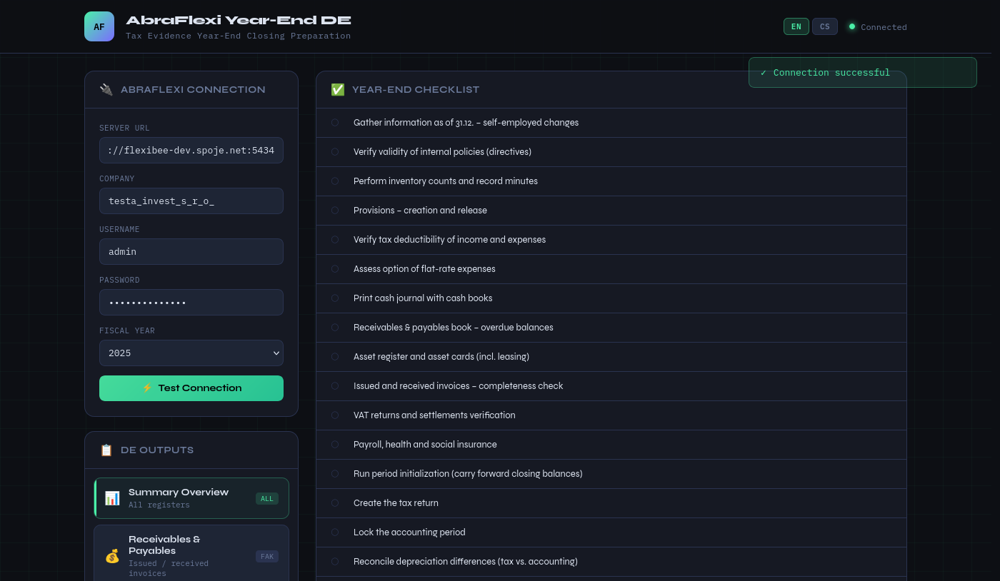
After clicking "Test Connection", the app performed a real authenticated
request against the AbraFlexi server. The status dot turns green and reads
"Connected", and a success toast confirms the credentials and URL are valid.

### 3. Dashboard with live data
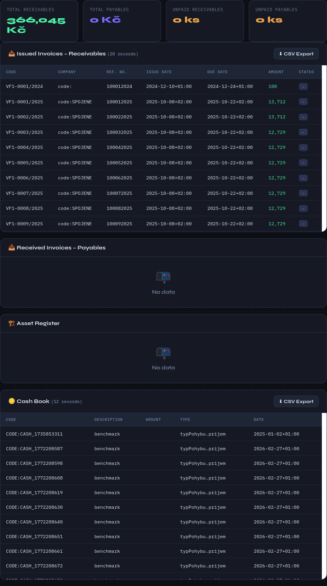
The "Summary Overview" module after clicking "Load data from AbraFlexi":
real totals (receivables, payables) and the Issued Invoices and Cash Book
tables populated with actual records pulled live from the test company.
Registers with no data for this company (Received Invoices, Asset Register)
correctly show an empty state instead of an error.

### 4. Year-End Checklist (initial state)
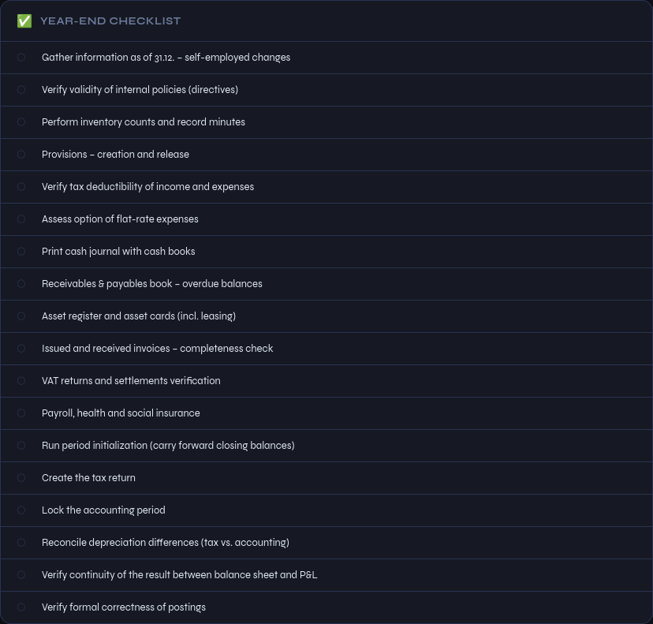
The full 18-step year-end checklist before any actions have run. Items 1–12
and 14, 16–18 are manual/judgment steps toggled by hand (inventory counts,
provisions, tax-return prep, etc.); items 13 ("Run period initialization")
and 15 ("Lock the accounting period") are wired to the two real actions
below and get checked automatically on success.

### 5. Period Initialization form
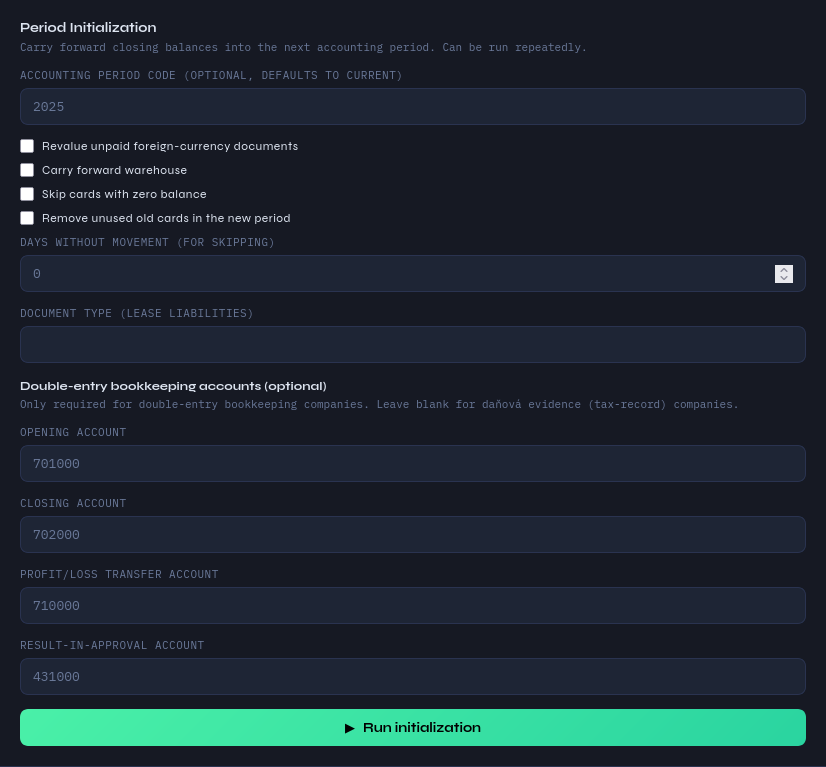
The Period Initialization form: accounting period code, revaluation/
warehouse-carry-forward/old-card-cleanup options, and — since this
particular test company uses double-entry bookkeeping rather than daňová
evidence — the optional opening/closing/profit-transfer/result-in-approval
account codes, filled in with real codes looked up from the company's own
chart of accounts.

### 6. Currency revaluation check
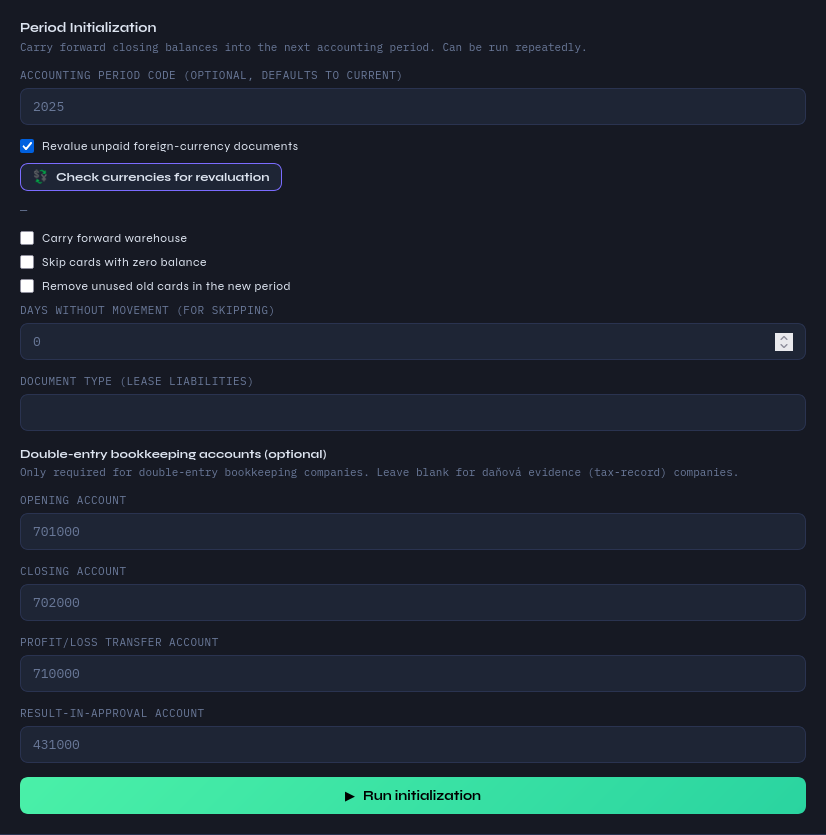
Result of clicking "Check currencies for revaluation" with the revaluation
checkbox enabled — for this company, no foreign-currency documents are
pending revaluation, so the list is empty. When currencies are found with a
missing/zero rate, they're listed here with editable rate fields before
running initialization.

### 7. Period Initialization running
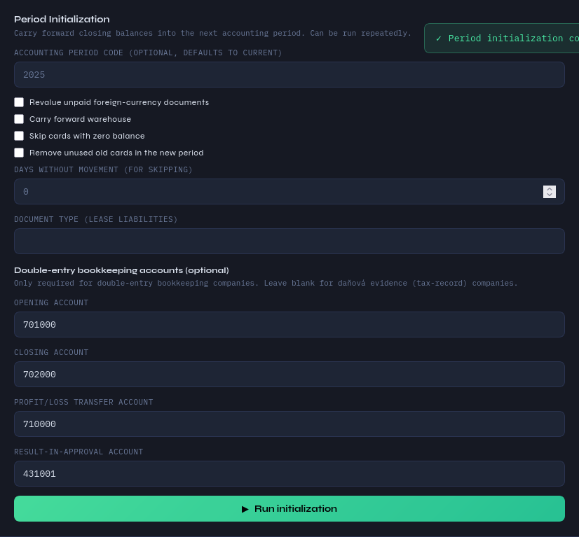
Immediately after clicking "Run initialization". AbraFlexi accepts the
request (HTTP 202) and processes it as a background job server-side; the
app shows a pending badge and starts polling for completion.

### 8. Period Initialization completed
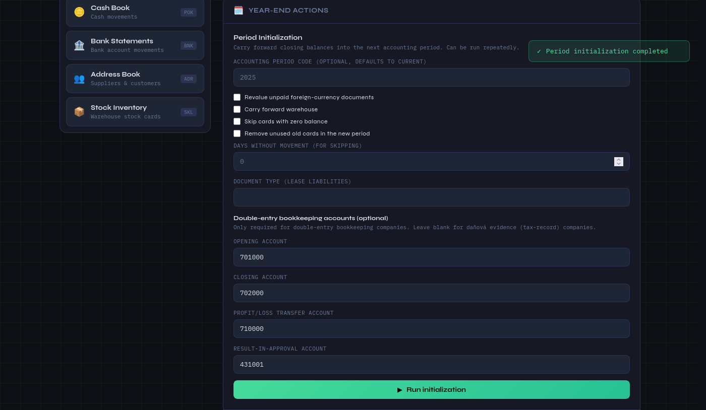
Once the app's polling detects the AbraFlexi job has finished (by watching
the accounting period's `lastUpdate` timestamp advance), it shows a success
toast and clears the pending badge.

### 8b. Checklist after initialization
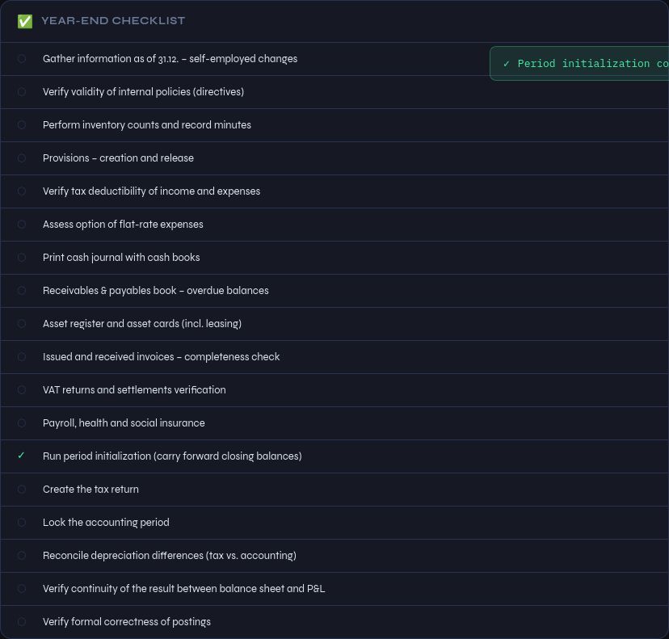
The checklist automatically reflects the real result: "Run period
initialization" is now checked, driven by the actual AbraFlexi response
rather than a manual click.

### 9. Period Lock form
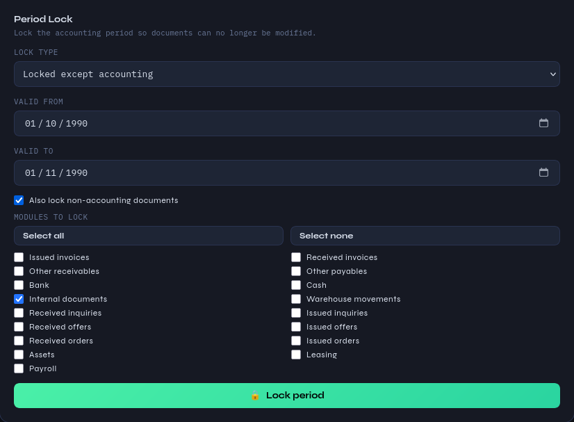
The Period Lock form, deliberately scoped narrowly for this real-write demo:
"Locked except accounting" state, a one-day historical date range, and only
the "Internal documents" module selected — minimizing impact on the shared
test company while still exercising the real write path.

### 10. Period Lock succeeded
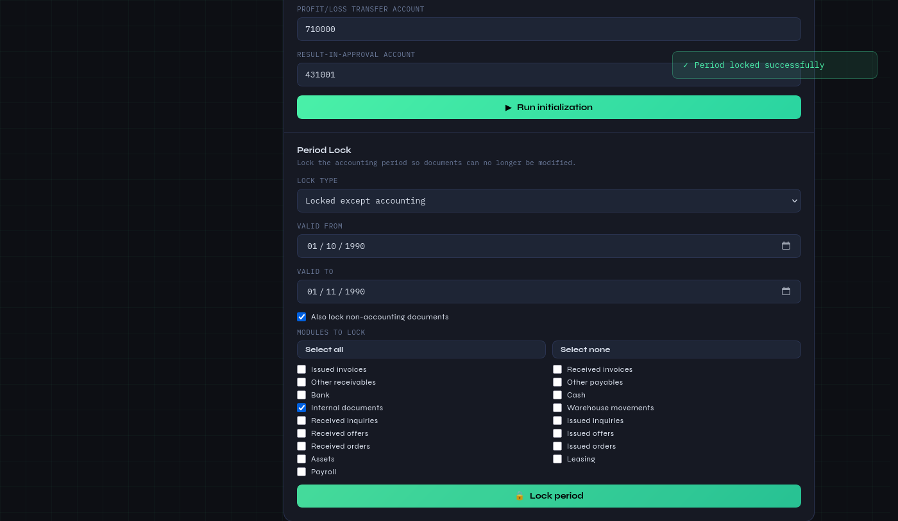
The result of clicking "Lock period" — AbraFlexi accepted and created the
lock record, confirmed by the success toast.

### 10b. Checklist after locking

Final state: both automated checklist items (13 and 15) are checked,
reflecting that period initialization and period locking both really
executed successfully against AbraFlexi.

## Requirements

- Python 3.8+
- flask
- flask-babel
- python-abraflexi >= 1.1.2
